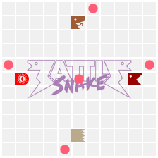

# Sandworm

_A competitive Battlesnake running minimax over Voronoi_

As of the time of writing, <!-- 2025-10-11 --> Sandworm ranks 4th out of 500+ snakes on the standard leaderboard and 5th out of 400+ snakes on the duels leaderboard.

## Battlesnake



[Battlesnake](https://battlesnake.com/) is a competitive multiplayer variant of the classic game Snake, and a platform atop which people around the world can write HTTP servers to control their own snakes. The main rules of the game are:

- If a server fails to respond with a move for its snake within 500 ms, the last move is repeated.
- Snakes move simultaneously; in the event of a head-to-head collision, the shorter snake dies.
- Snakes have 100 health points, one is consumed each turn, and a snake dies when it runs out.
- Consuming food resets health back to 100 and lengthens the snake’s tail on the following turn.
- Tail pieces are removed before head pieces are added, so moving into someone’s tail is okay.

## Strategy

Sandworm runs paranoid minimax with α–β pruning and iterative deepening over a Voronoi heuristic. Game state is stored in bitboards and is updated in-place. With the search timeout set to 400 ms it typically reaches depth 20–24 or so (10–12 turns ahead with two snakes on the board, 5–6 turns ahead with four). All the logic is in [move.c](move.c).

## Usage

Build and run the server with:

```sh
make all
lighttpd -f cgi.conf
```
